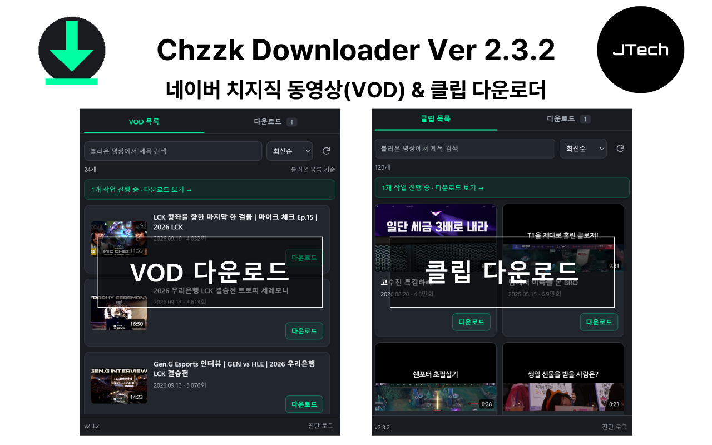
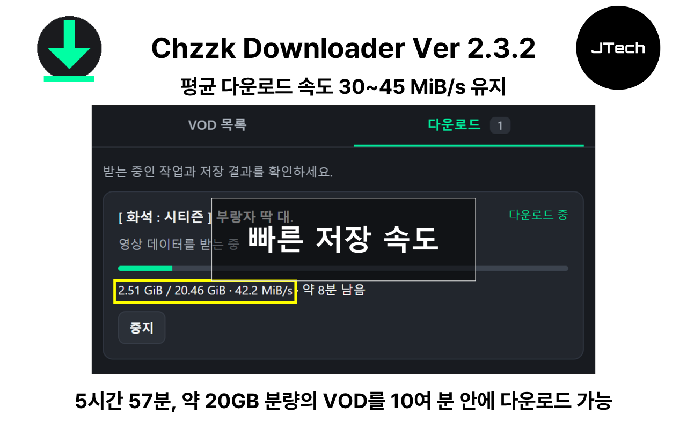
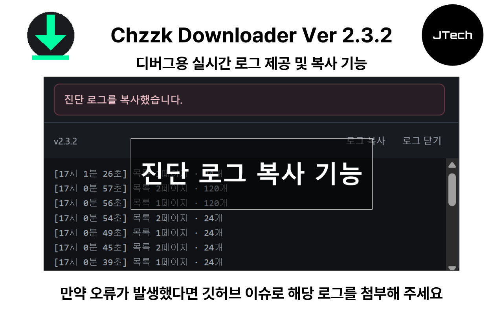

# Chzzk Downloader

네이버 치지직의 VOD와 클립을 MP4로 저장하는 Chrome 확장 프로그램입니다. 현재 버전은 `2.3.3`입니다.

<p align="center">
  
  
  
</p>

재생 정보 조회의 CORS 오류와 일시적인 MP4 사전 확인 실패로 다운로드를 시작하지 못하던 경로를 보완했습니다. 실패 시 요청 단계와 서버를 함께 표시합니다.

수정 내용은 [버그 리포트](docs/bug-report.md)에 있으며, 개인정보 처리방침은 [이 문서](<https://jtech-co.github.io/chzzk-downloader/docs/privacy-policy.html>)에 있습니다.

## 바로 설치하기

1. Chrome의 확장 프로그램 관리 화면(`chrome://extensions`)에서 **개발자 모드**를 켭니다.
2. **압축 해제된 확장 프로그램을 로드합니다**를 누르고 이 저장소의 **[dist](dist/)** 폴더를 선택합니다.
3. 치지직 채널 페이지를 새로고침합니다.

`dist`에는 실행에 필요한 모든 파일이 들어 있습니다. 직접 설치할 때 Node.js나 빌드 작업은 필요하지 않습니다. 이후 파일을 갱신하면 확장 프로그램과 치지직 탭을 모두 새로고침합니다.

기존 프로젝트 루트를 등록한 설치는 사용 중지하고 `dist`를 새로 등록합니다. 설치 경로가 달라지면 기존 작업 기록이 새 설치로 자동 이전되지 않을 수 있습니다.

## 폴더 구성

```text
chzzk-downloader/
├─ src/          확장프로그램 원본 코드·매니페스트·아이콘
├─ dist/         Chrome에서 바로 로드할 실행 파일
├─ releases/     현재 버전의 스토어 업로드용 ZIP
├─ docs/         사용 안내·버그 및 변경 보고서·개인정보 처리방침·이미지·검증 결과
├─ scripts/      빌드·패키징 도구와 수동 검증 도구
├─ tests/        자동 테스트 및 합성 테스트 데이터
├─ legacy/       이전 버전과 폴더 정리 전 보존본
└─ test-results/ 자동 테스트 실행 시 생성되는 결과 (Git 제외)
```

코드는 `src`에서 수정합니다. `dist`는 빌드할 때 원본에서 새로 생성되므로 직접 편집한 내용은 덮어써집니다. `dist`와 `releases`는 저장소에 포함하는 배포 결과물입니다.

## 개발과 패키징

Node.js 20 이상을 사용합니다. ZIP 패키징은 Windows PowerShell 5 이상에서 실행합니다.

```powershell
npm ci
npx playwright install chromium
npm run build
npm test
npm run package
```

- `npm run build`: 버전과 필수 파일을 검사하고 `dist`를 생성합니다.
- `npm test`: `dist`를 빌드한 뒤 자동 테스트를 실행합니다. 실제 확장프로그램 통합 테스트는 `dist`를 기준으로 실행합니다. 저장 한도 재현 테스트는 격리된 복사본을 사용합니다.
- `npm run package`: 새로 빌드한 `dist`를 `releases/chzzk-downloader-v<버전>.zip`으로 패키징하고 파일 해시를 검증합니다.

[상세 사용 안내](docs/usage.md) · [버그 및 변경 보고서](docs/bug-report.md) · [레거시 안내](legacy/README.md) · [수동 검증 도구](scripts/manual/README.md)
